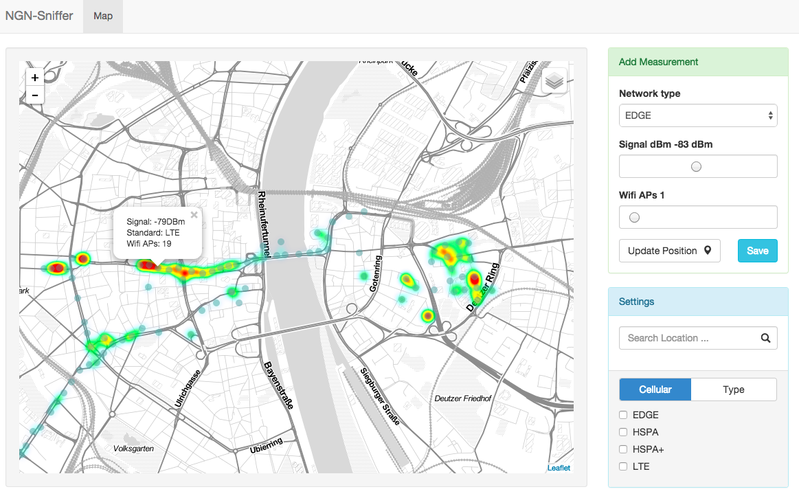

# ngn-sniffer 
Android and Web based APP for a lecture called Next Generation Networks (NGN) to collect and visualize location based rf signals like Cellular, Bluetooth or Wifi.

> Android App Screenshot

> Web Frontend Screenshot ([Heroku](http://ngn.herokuapp.com/))

### NGN-Sniffer Server

This app is running on [Heroku](http://ngn.herokuapp.com/)

To run the server you need the following things:

* install __node__ with __npm__
* install __bower__ and __gulp__ globally with `npm install -g bower gulp`
* run `npm install` and `bower install` to install server dependencies (in server folder) 
* you need a running MongoDB Instance on localhost
* run `gulp` to start the service on `localhost:5000`

 
#### API Reference

| Endpoint | Action | Parameter | Answere | Description | 
|----------|--------|-----------|---------|-------------|
| `http://host/measurement` | POST | lat:double, lng:double, type:varchar, signalDBm:int, wifiAPs:int | JSON Array | Save measurement|
| `http://host/measurement/signal` | GET | nelat:double, nelng:double, swlat:double, swlng:double | JSON Array | Load weighted heatmap points for signal strength |
| `http://host/measurement/wifi` | GET | nelat:double, nelng:double, swlat:double, swlng:double | JSON Array | Load weighted heatmap points for wifi access points |

